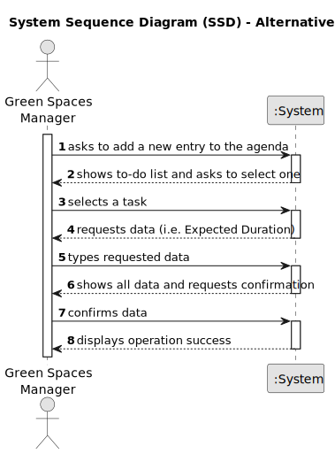
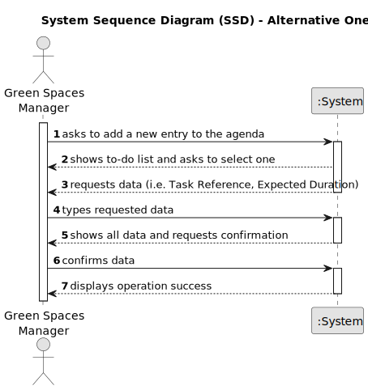

# US022 - ... 

## 1. Requirements Engineering

### 1.1. User Story Description

As a GSM, I want to add a new entry in the Agenda.

### 1.2. Customer Specifications and Clarifications 

**From the specifications document:**

>	...

>	... 

**From the client clarifications:**

> **Question:** ...
>
> **Answer:** ...

> **Question:** ...
>
> **Answer:** ...

### 1.3. Acceptance Criteria

* **AC1:** The new entry must be associated with a green space man aged by the GSM.
* **AC2:** The new entry must exist in the To-Do list.
* **ACX:** 
* **ACX:** System must ensure that only GSM adds a new entry in the Agenda.

### 1.4. Found out Dependencies

* There is a dependency on "US020 - ..." as there must be at least one green space to be associated with the new entry in the agenda.
* There is a dependency on "US021 - ..." because the new entry in the Agenda must exist in the To-Do List.

### 1.5 Input and Output Data

**Input Data:**

* Typed data:
    *
	
* Selected data:
    * List of Green Spaces 
    * To-Do List

**Output Data:**

* All data of the new entry in the Agenda
* (In)Success of the operation

### 1.6. System Sequence Diagram (SSD)

**_Other alternatives might exist._**

#### Alternative One

#### Alternative Two

### 1.7 Other Relevant Remarks

* n/a