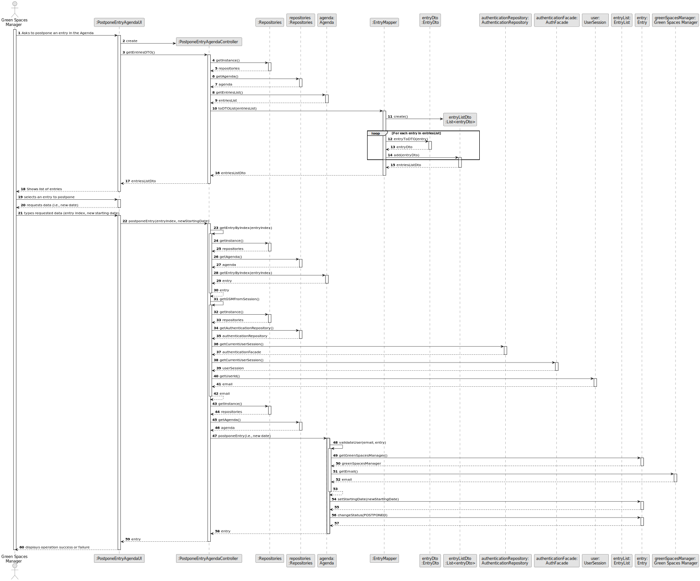
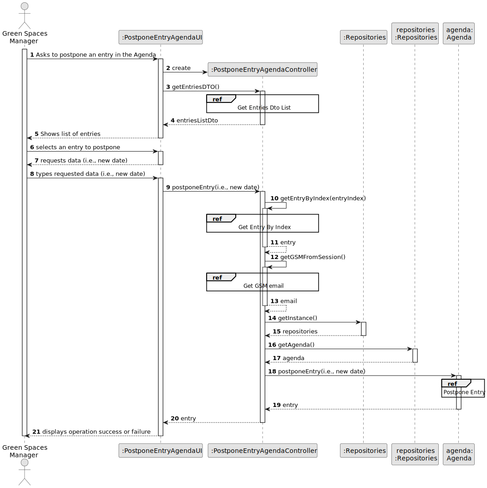
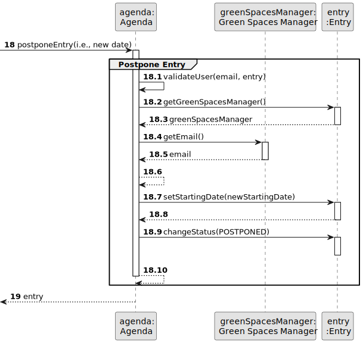
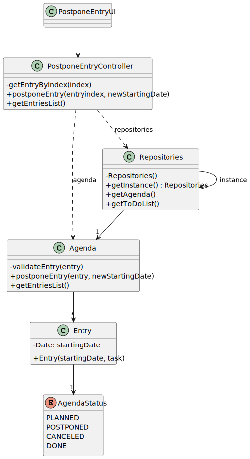

# US024 - Postpone an Entry

## 3. Design - User Story Realization 

### 3.1. Rationale

_**Note that SSD - Alternative One is adopted.**_

| Interaction ID | Question: Which class is responsible for... | Answer               | Justification (with patterns)                                                                                 |
|:-------------  |:--------------------- |:---------------------|:--------------------------------------------------------------------------------------------------------------|
| Step 1  		 |	... interacting with the actor? | PostponeEntryAgendaUI         | Pure Fabrication: there is no reason to assign this responsibility to any existing class in the Domain Model. |
| 			  		 |	... coordinating the US? | PostponeEntryAgendaController | Controller                                                                                                    |
| 			  		 | ... knowing the user using the system?  | UserSession          | IE: cf. A&A component documentation.                                                                          |
| Step 2  		 |	... postpone an entry						 | Collaborator                     |                                                                                                               |
| Step 3  		 |	...saving the inputted data? | Agenda                 | IE: object created in step 1 has its own data.                                                                |
| Step 5  		 |	... saving the selected entry? | Entry                 | IE: object created in step 1 is classified in one Category.                                                   |
| Step 6  		 |		showing all available entries				 |   Agenda                   |  IE: knows all its entries.                                                                                                               |              
| Step 7  		 |	... validating all data (local validation)? | Entry                | IE: owns its data.                                                                                            | 
| 			  		 |	... validating all data (global validation)? | Agenda         | IE: knows all its entries.                                                                                      | 
| 			  		 |	... saving the posponed entry? | Agenda         | IE: owns all its entries.                                                                                       | 
| Step 8  		 |	... informing operation success?| PostponeEntryAgendaUI         | IE: is responsible for user interactions.                                                                     | 

### Systematization ##

According to the taken rationale, the conceptual classes promoted to software classes are: 

* Agenda
* Entry

Other software classes (i.e. Pure Fabrication) identified: 

* PostponeEntryAgendaUI  
* PostponeEntryAgendaController

## 3.2. Sequence Diagram (SD)

_**Note that SSD - Alternative Two is adopted.**_

### Full Diagram

This diagram shows the full sequence of interactions between the classes involved in the realization of this user story.

### Split Diagrams

The following diagram shows the same sequence of interactions between the classes involved in the realization of this user story, but it is split in partial diagrams to better illustrate the interactions between the classes.

It uses Interaction Occurrence (a.k.a. Interaction Use).

**Get Task Category List Partial SD**

**Get Task Category Object**

**Get Employee**

**Create Task**

## 3.3. Class Diagram (CD)

