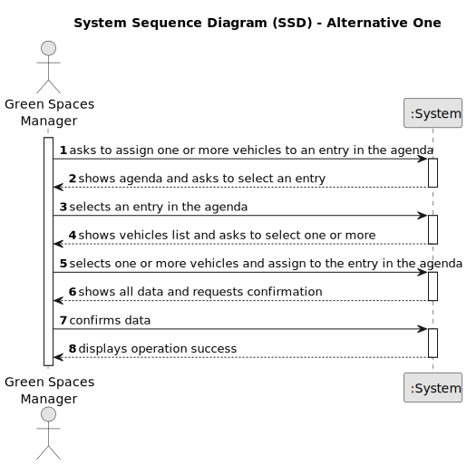

# US026 - ...

## 1. Requirements Engineering

### 1.1. User Story Description

As a GSM, I want to assign one or more vehicles to an entry in the Agenda.

### 1.2. Customer Specifications and Clarifications 

**From the specifications document:**

>	...

>	...

**From the client clarifications:**

> **Question:** ...
>
> **Answer:** ...

> **Question:** ...
>
> **Answer:** ...

### 1.3. Acceptance Criteria

* **ACX:**
* **ACX:** System must ensure that only GSM assigns one or more vehicles to an Agenda entry.

### 1.4. Found out Dependencies

* There is a dependency on "US006 - ..." as there must be at least one registered vehicle to be able to assign.
* There is a dependency on "US022 - ..." as there must be at least one entry in the agenda.

### 1.5 Input and Output Data

**Input Data:**

* Typed data:
  *

* Selected data:
  * List of Vehicles
  * Entry in the Agenda

**Output Data:**

* All vehicles data
* Entry in the Agenda
* (In)Success of the operation

### 1.6. System Sequence Diagram (SSD)

**_Other alternatives might exist._**

#### Alternative One

#### Alternative Two

### 1.7 Other Relevant Remarks

* n/a