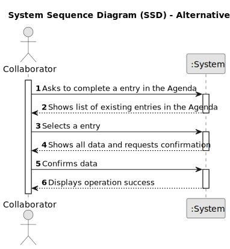

# US029 - Record the completion of a task 

## 1. Requirements Engineering

### 1.1. User Story Description

- As a Collaborator, I want to record the completion of a task.

### 1.2. Customer Specifications and Clarifications 

**From the specifications document:**

>	...

>	... 

**From the client clarifications:**

> **Question:** Can a collaborator mark a task as "done" only if it is in the "planned" status?
>
> **Answer:** It depends in the status set your team decide to have/use. But if you consider only status refered in the text and in the forum my answer would be, yes, just the "Planned" status can be changed to "Done".

> **Question:**
"As a Collaborator, I want to record the completion of a task."
This "record" refers to the act of only changing the status of the task, or do we want to save a list of the completed tasks within each Collaborator?
>
> **Answer:** It means to record that a task was completed (changing the status) with the finish time.

> **Question:** The collaborator can see what type of entry's? Like what status can he filter ? Can he see canceled Entry's?
>
> **Answer:** The ones assigned to him. He can filter by the different values the status of the status, like planned, executed, canceled ...

> **Question:** Can an employee record more than one completed task at a time?
>
> **Answer:** It's a matter of UX/UI, each dev team can decide about it.

### 1.3. Acceptance Criteria

* **AC1:** ...
* **AC2:** ...
* **AC3:** ...

### 1.4. Found out Dependencies

* ...

### 1.5 Input and Output Data

**Input Data:**

* Typed data:
    * ...
    * ...
    * ...
    * ...
    * ...
    * ...
	
* Selected data:
    * ... 

**Output Data:**

* List of existing task categories 
* (In)Success of the operation

### 1.6. System Sequence Diagram (SSD)

**_Other alternatives might exist._**

#### Alternative One

#### Alternative Two

### 1.7 Other Relevant Remarks

* n/a