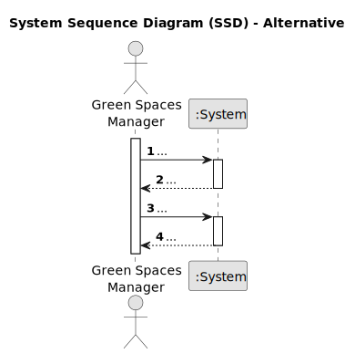

# US011 - ... 

## 1. Requirements Engineering

### 1.1. User Story Description

As a GSM, I want to be able to collect data from the user portal about the use of the park, so that I may understand the use of the park by different age groups.

### 1.2. Customer Specifications and Clarifications 

**From the specifications document:**

>	...

>	...

**From the client clarifications:**

> **Question:** ...
>
> **Answer:** ...

> **Question:** ...
>
> **Answer:** ...

### 1.3. Acceptance Criteria

* **AC1:** Number of times you visit the park per month must be zero or a positive number.
* **AC2:** Age must be zero or a positive number.
* **AC3:** ...

### 1.4. Found out Dependencies

* There is no dependencies.

### 1.5 Input and Output Data

**Input Data:**

* Typed data:
    * Age
    * Number of times visited the park per month
	
* Selected data:
    * "Y" or "N"

**Output Data:**

* ...
* (In)Success of the operation

### 1.6. System Sequence Diagram (SSD)

**_Other alternatives might exist._**

#### Alternative One

#### Alternative Two

### 1.7 Other Relevant Remarks

* ...