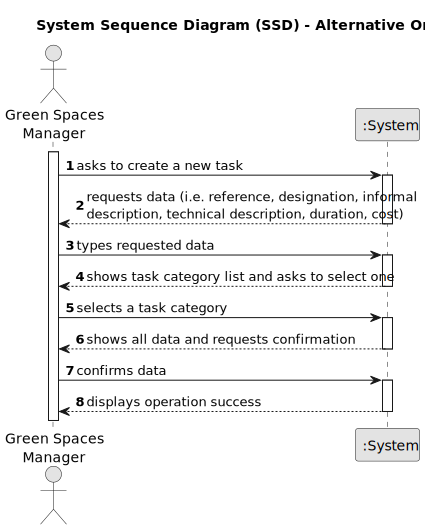

# US012 - ...

## 1. Requirements Engineering

### 1.1. User Story Description

As a GSM, I want to import a .csv file containing lines with: *Water Point X, Water Point Y, Distance* into a unique data structure.

### 1.2. Customer Specifications and Clarifications 

**From the specifications document:**

>	The set of imported lines describes all possible routes that can be opened to lay pipes between each pair of water points, and their respective installation costs (these could simply refer to the length, or to any other cost parameter).

>	...

**From the client clarifications:**

> **Question:** ...
>
> **Answer:** ...

> **Question:** ...
>
> **Answer:** ...

### 1.3. Acceptance Criteria

* **AC1:** System must ensure that only GSM imports .csv files.
* **AC2:** ...
* **AC3:** ...

### 1.4. Found out Dependencies

* There is no dependencies.

### 1.5 Input and Output Data

**Input Data:**

* Typed data:
    * .csv file
	
* Selected data:
    * ...

**Output Data:**

* ...

### 1.6. System Sequence Diagram (SSD)

**_Other alternatives might exist._**

#### Alternative One

#### Alternative Two

### 1.7 Other Relevant Remarks

* ...