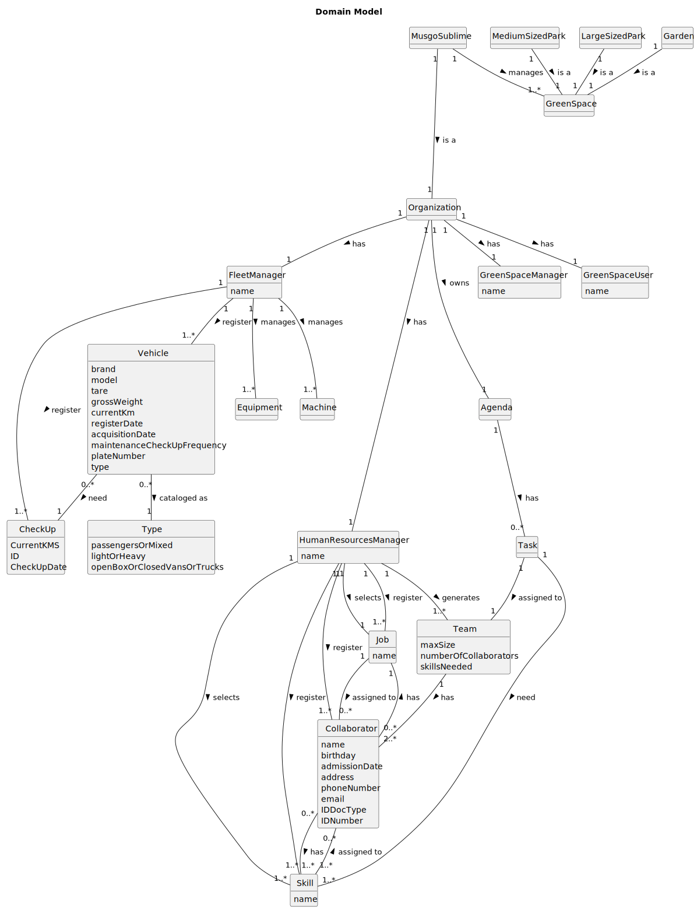

# OO Analysis

The construction process of the domain model is based on the client specifications, especially the nouns (for _concepts_) and verbs (for _relations_) used.

## Rationale to identify domain conceptual classes
To identify domain conceptual classes, start by making a list of candidate conceptual classes inspired by the list of categories suggested in the book "Applying UML and Patterns: An Introduction to Object-Oriented Analysis and Design and Iterative Development".

### _Conceptual Class Category List_

**Business Transactions**

* Skills 
* Jobs 
* Tasks 
* Team proposal generation 
* Vehicles/Machines/Equipment Maintenance
* VER MELHOR

---

**Transaction Line Itemss**

* VER MELHOR

---

**Product/Service related to a Transaction or Transaction Line Item**

* Equipment
* Machine
* Vehicle
* VER MELHOR

---

**Transaction Records**

* VER MELHOR

---  

**Roles of People or Organizations**

* Collaborator
* FleetManager
* HumanResourcesManager
* GreenSpacesManager 
* GreenSpacesUser

---

**Places**

* Organization
* GreenSpaces
* Garden
* Medium-sized park
* Large-sized park

---

**Noteworthy Events**

* VER MELHOR

---

**Physical Objects**

* Equipment
* Machine
* Vehicle

---

**Descriptions of Things**

* Skill
* Job

---

**Catalogs**

* Vehicles
* Equipments
* Machines
* Jobs
* Skills

---

**Containers**

* Team

---

**Elements of Containers**

* Collaborator

---

**Organizations**

* Musgo Sublime

---

**Other External/Collaborating Systems**

* User Portal

---

**Records of finance, work, contracts, legal matters**

* Work Records
* Maintenance Records

---

**Financial Instruments**

* 

---

**Documents mentioned/used to perform some work/**

* 

---

## Rationale to identify associations between conceptual classes

An association is a relationship between instances of objects that indicates a relevant connection and that is worth of remembering, or it is derivable from the List of Common Associations:

- **_Agenda_** has **_Task_**
- **_Collaborator_** has **_Skill_**
- **_Collaborator_** has **_Job_**
- **_FleetManager_** register **_Vehicle_**
- **_FleetManager_** creates **_CheckUp_**
- **_FleetManager_** manages **_Machine_**
- **_FleetManager_** manages **_Equipment_**
- **_FleetManager_** manages **_Organization_**
- **_Garden_** is a **_GreenSpace_**
- **_GreenSpaceManager_** manages **_Organization_**
- **_GreenSpaceUser_** manages **_Organization_**
- **_HumanResourcesManager_** register **_Collaborator_**
- **_HumanResourcesManager_** register **_Skill_**
- **_HumanResourcesManager_** selects **_Job_**
- **_HumanResourcesManager_** register **_Job_**
- **_HumanResourcesManager_** selects **_Skill_**
- **_HumanResourcesManager_** generates **_Team_**
- **_HumanResourcesManager_** manages **_Organization_**
- **_Job_** assigned to **_Collaborator_**
- **_LargeSizedPark_** is a **_GreenSpace_**
- **_MediumSizedPark_** is a **_GreenSpace_**
- **_MusgoSublime_** is a **_Organization_**
- **_MusgoSublime_** manages **_GreenSpace_**
- **_Skill_** assigned to **_Collaborator_**
- **_Task_** need **_Skill_**
- **_Task_** assigned to **_Team_**
- **_Team_** owns **_Collaborator_**
- **_Vehicle_** owns **_CheckUp_**

| Concept (A) 		        | Association   	 |  Concept (B) |
|-----------------------|:---------------:|-------------:|
| Agenda                |       has       |         Task |
| Collaborator          |       has       |        Skill |
| Collaborator          |       has       |          Job |
| FleetManager          |    register     |      Vehicle |
| FleetManager          |     creates     |      CheckUp |
| FleetManager          |     manages     |      Machine |
| FleetManager          |     manages     |    Equipment |
| FleetManager          |     manages     | Organization |
| Garden                |       is        |   GreenSpace |
| GreenSpaceManager     |     manages     | Organization |
| GreenSpaceUser        |     manages     | Organization |
| HumanResourcesManager |    register     | Collaborator |
| HumanResourcesManager |    register     |        Skill |
| HumanResourcesManager |     selects     |          Job |
| HumanResourcesManager |    register     |          Job |
| HumanResourcesManager |     selects     |        Skill |
| HumanResourcesManager |    generates    |         Team |
| HumanResourcesManager |     manages     | Organization |
| Job                   |   assigned to   | Collaborator |
| LargeSizedPark        |      is a       |   GreenSpace |
| MediumSizedPark       |      is a       |   GreenSpace |
| MusgoSublime          |      is a       | Organization |
| MusgoSublime          |     manages     |   GreenSpace |
| Skill                 |   assigned to   | Collaborator |
| Task                  |      need       |        Skill |
| Task                  |   assigned to   |         Team |
| Team                  |      owns       | Collaborator |
| Vehicle               |      owns       |      CheckUp |

## Domain Model

**Do NOT forget to identify concept atributes too.**

**Insert below the Domain Model Diagram in a SVG format**

