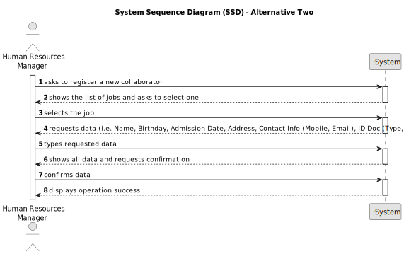

# US003 - Register collaborator with job and fundamental characteristics

## 1. Requirements Engineering

### 1.1. User Story Description

As an HRM, I want to register a collaborator with a job and fundamental characteristics.

### 1.2. Customer Specifications and Clarifications

**From the specifications document:**

>   Human resources manager fills in all fields for collaborator registration.

>	Each collaborator is characterized by having a unique name, a date of birth, a date of admission, an adornment, a type of identification document and a number, as well as two contact details (mobile phone and email).

>	The job will be chosen from the list of jobs registered in US02.

**From the client clarifications:**

> **Question:** Does the HRM select the job from a list that we display?
>
> **Answer:** Displaying or not, It's a matter of UX, the dev team should decide about it, but the valid jobs are the ones created within the US02.

> **Question:** Should the system able the HRM to insert multiple collaborators in one interaction before saving them?
>
> **Answer:** It's not required to do so.

### 1.3. Acceptance Criteria

* **AC01:** Name, birthdate, admission date, address, contact info (mobile and email), ID doc type and respective number should be provided by HRM.
* **AC02:** All mandatory fields must be filled in.
* **AC03:** The name can only contain letters and spaces.
* **AC04:** Birthdate and submission data can only contain numbers and must follow the format provided.
* **AC05:** Birthdate can only be a past date.
* **AC06:** Residence must be written including: house number, street, postal code, city and country.
* **AC07:** Mobile number can only have 9 numbers.
* **AC08:** Email cannot contain spaces and must contain "@".
* **AC09:** The user will select an identification document type from a list.
* **AC10:** Email cannot contain spaces and must contain "@".
* **AC11:** Contribution number can only have numbers.
* **AC12:** The user will select a job from the list of jobs registered in US02.
* **AC13:** Collaborator must not have a registered account

### 1.4. Found out Dependencies

* ...

### 1.5 Input and Output Data

**Input Data:**

* Typed data:
  * ...
  * ...
  * ...
  * ...
  * ...
  * ...

* Selected data:
  * ...

**Output Data:**

* ...
* ...

### 1.6. System Sequence Diagram (SSD)

**_Other alternatives might exist._**

#### Alternative One

#### Alternative Two

### 1.7 Other Relevant Remarks

* ...