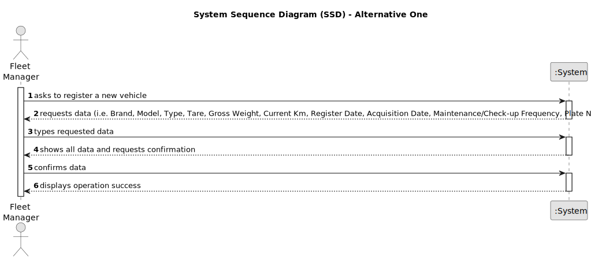

# US006 - Register a vehicle

## 1. Requirements Engineering

### 1.1. User Story Description

As an FM, I wish to register a vehicle including Brand, Model, Type, Tare, Gross Weight, Current Km, Register Date, Acquisition Date, Maintenance/Checkup Frequency (in Kms).

### 1.2. Customer Specifications and Clarifications 

**From the specifications document:**

>	... 

>	...

**From the client clarifications:**

> **Question:** ...
>
> **Answer:** ...

> **Question:** ...
>
> **Answer:** ...

### 1.3. Acceptance Criteria

* **AC1:** ...

### 1.4. Found out Dependencies

* ...

### 1.5 Input and Output Data

**Input Data:**

* Typed data:
    * ...
    * ...
    * ...
    * ...
    * ...
    * ...
	
* Selected data:
    * ...

**Output Data:**

* ...
* ...

### 1.6. System Sequence Diagram (SSD)

**_Other alternatives might exist._**

#### Alternative One

#### Alternative Two

### 1.7 Other Relevant Remarks

* ...